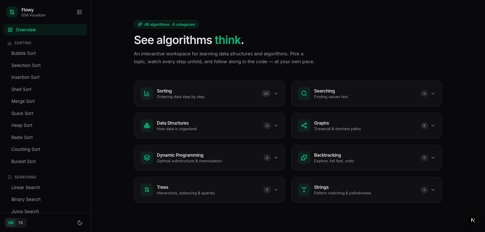
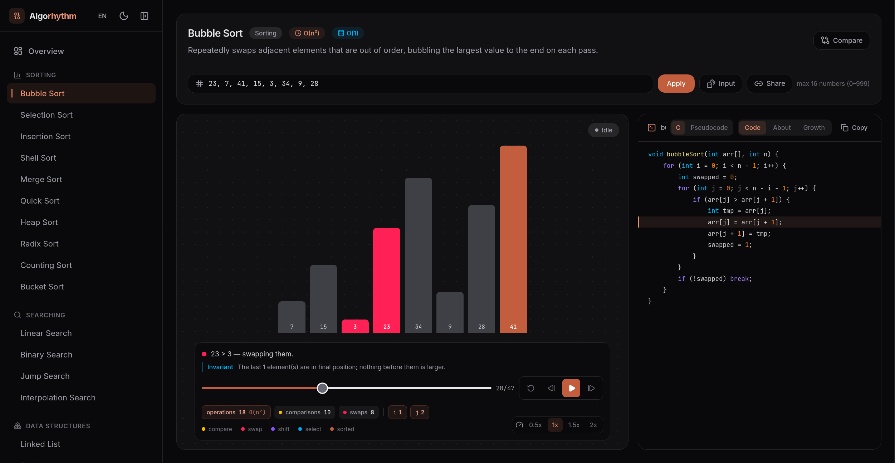
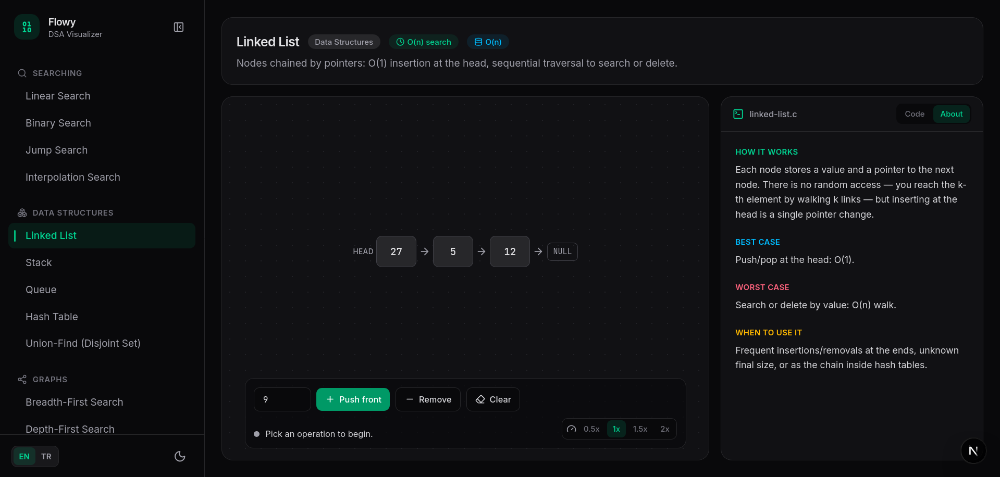

# Algorhythm

Interactive platform for learning data structures and algorithms by watching
them run — step by step, with the corresponding C code line highlighted as it
executes.

**[View the live application here.](https://algorhythm-batuhanmeral.vercel.app/)**

## Algorithms

**58 algorithms · 10 categories · every page statically generated**

| Category | Algorithms |
| --- | --- |
| Sorting | Bubble, Selection, Insertion, Shell, Merge, Quick, Heap, Radix, Counting, Bucket |
| Searching | Linear, Binary, Jump, Interpolation |
| Data Structures | Linked List, Stack, Queue, Hash Table, Union-Find |
| Graphs | BFS, DFS, Dijkstra, Bellman-Ford, Floyd-Warshall, Topological Sort, Prim, Kruskal, A* |
| Dynamic Programming | LCS, 0/1 Knapsack, Edit Distance, Coin Change, Fibonacci, Kadane, LIS |
| Greedy | Activity Selection, Fractional Knapsack, Job Sequencing, Huffman Coding |
| Backtracking | N-Queens, Sudoku, Rat in a Maze, Subsets, Permutations |
| Trees | BST, AVL, Binary Heap, Trie, Segment Tree |
| Strings | KMP, Rabin-Karp, Boyer-Moore, Z-Algorithm, Manacher |
| Math / Number Theory | Sieve of Eratosthenes, Euclidean GCD, Extended Euclid, Fast Exponentiation |

## Features

- **Step player** — play/pause, single-step, scrubber timeline, 0.5–2× speed,
  keyboard shortcuts (space = play/pause, ←/→ = step)
- **A visualization tailored to each family** — animated bars, node-edge
  graphs, DP tables, chess boards, self-balancing trees, sliding pattern
  windows, interval timelines, a merging Huffman forest, a prime grid and more
- **C or pseudocode** — a dependency-free tokenizer colours either view, and
  because the pseudocode is aligned line for line with the C, a single step
  highlights the right line in both. Your choice is remembered; copy button
  included
- **"Why this step?"** — under every step note, the loop invariant that holds
  right now. The note says what happened; the invariant says why it was allowed
- **About tab** — per-algorithm intuition, best/worst case behaviour and
  when-to-use notes, in both languages
- **Growth tab** — measured operations (comparisons, swaps, moves, probes) at
  growing input sizes, with the algorithm's stated complexity fitted over them
  and your current input marked on the curve. Toggle to animation steps to see
  what the visualization adds on top
- **Input shapes** — load the inputs where best and worst cases actually
  separate: already sorted, reversed, nearly sorted, all equal, few distinct
  values, wide value range
- **Draw your own graph** — add, drag and delete nodes, toggle edges, edit
  weights, switch between directed and undirected, then rerun on your graph.
  Cycles and negative cycles are reported rather than silently mishandled
- **Bilingual (TR/EN)** — an EN/TR toggle in the navbar switches the whole UI,
  all algorithm/category names and summaries, and every step explanation,
  persisted across visits
- **Custom input** — type your own numbers/strings, pick start nodes, edit
  graph edges, choose board sizes, feed Huffman any text, set GCD/power
  operands
- **Compare mode** — race two algorithms of the same family on one input and
  a single timeline, with live operation counters
- **Stat counters & variable watch** — comparisons/swaps/moves/probes and live
  loop variables (`i`, `j`, `pivot`, `lo/hi`, …) per step
- **Shareable URLs** — input, target and step number encoded in the link
- **Dark mode** — manual toggle, persisted, no flash on load

## Stack

Next.js (App Router, SSG) · TypeScript · Tailwind CSS v4 · Framer Motion ·
Lucide icons · Inter + JetBrains Mono (`next/font`).

## Installation

```bash
npm install
npm run dev    # http://localhost:3000
npm run build  # static production build
npm run lint
```

## Screenshots

| |
| :---: |
|  |
| *Overview* |
|  |
| *Bubble Sort — step player, stat counters and C code highlighting* |
|  |
| *Linked List — interactive operations with C code highlighting* |

## License

MIT — see [LICENSE](LICENSE).
