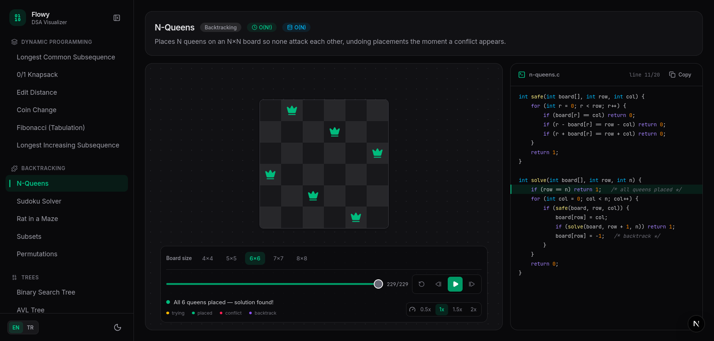

# Flowy - DSA Visualizer

An interactive platform for learning data structures and algorithms by watching
them run — step by step, with the corresponding C code line highlighted as it
executes.

**63 algorithms · 10 categories · every page statically generated**

| Category | Algorithms |
| --- | --- |
| Sorting | Bubble, Selection, Insertion, Shell, Merge, Quick, Heap, Radix, Counting, Bucket |
| Searching | Linear, Binary, Jump, Interpolation |
| Data Structures | Linked List, Stack, Queue, Hash Table (operation-driven playgrounds) |
| Graphs | BFS, DFS, Dijkstra, Bellman-Ford, Topological Sort, Prim, Kruskal, A* |
| Dynamic Programming | LCS, 0/1 Knapsack, Edit Distance, Coin Change, Fibonacci, LIS |
| Greedy | Activity Selection, Fractional Knapsack, Job Sequencing, Huffman Coding |
| Backtracking | N-Queens, Sudoku, Rat in a Maze, Subsets, Permutations |
| Trees | BST, AVL, Binary Heap, Trie, Segment Tree |
| Strings | KMP, Rabin-Karp, Z-Algorithm, Manacher |
| Math / Number Theory | Sieve of Eratosthenes, Euclidean GCD, Fast Exponentiation |

## Features

- **Step player** — play/pause, single-step, scrubber timeline, 0.5–2× speed,
  keyboard shortcuts (space = play/pause, ←/→ = step)
- **A visualization tailored to each family** — animated bars, node-edge
  graphs, DP tables, chess boards, self-balancing trees, sliding pattern
  windows, interval timelines, a merging Huffman forest, a prime grid and more
- **Syntax-highlighted C code** — a dependency-free tokenizer colours the
  snippet; every animation step points at the exact source line it corresponds
  to, plus a copy button
- **Bilingual (TR/EN)** — an EN/TR toggle in the navbar switches the whole UI
  and all algorithm/category names and summaries, persisted across visits
- **Custom input** — type your own numbers/strings, pick start nodes, edit
  graph edges, choose board sizes, feed Huffman any text, set GCD/power
  operands
- **Compare mode** — race two algorithms of the same family on one input and
  a single timeline, with live operation counters
- **Stat counters & variable watch** — comparisons/swaps/moves/probes and live
  loop variables (`i`, `j`, `pivot`, `lo/hi`, …) per step
- **Shareable URLs** — input, target and step number encoded in the link
- **Dark mode** — manual toggle, persisted, no flash on load

## Stack

Next.js (App Router, SSG) · TypeScript · Tailwind CSS v4 · Framer Motion ·
Lucide icons · Inter + JetBrains Mono (`next/font`).

## Installation

```bash
npm install
npm run dev    # http://localhost:3000
npm run build  # static production build
npm run lint
```

## Screenshots

| |
| :---: |
|  |
| *Overview* |
|  |
| *Bubble Sort — step player, stat counters and C code highlighting* |
|  |
| *N-Queens — backtracking on the board* |

## License

MIT — see [LICENSE](LICENSE).
